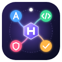
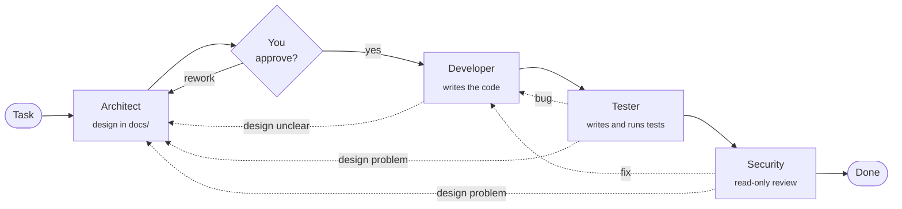

<p align="center">
  
</p>

<h1 align="center">AI Harness</h1>

<p align="center">
  <b>A conductor for a team of AI coding agents.</b><br>
  It leads a task through Architect, Developer, Tester and Security roles,<br>
  each played by a real console agent: Claude Code, Codex CLI, Antigravity CLI or DeepSeek Harness.
</p>

<p align="center">
  <a href="https://github.com/aeygenson/ai-harness/actions/workflows/ci.yml"></a>
  <a href="https://github.com/aeygenson/ai-harness/actions/workflows/security.yml"></a>
  <a href="https://github.com/aeygenson/ai-harness/releases/latest"></a>
  
  
</p>

---

## Why it exists

One AI agent working alone on a project tends to grade its own homework: it writes the code,
decides the code is fine, and moves on. Real teams do better because different people check
each other's work.

AI Harness gives AI agents the same structure. Instead of one long chat, a task goes through
a small team with clear jobs, written handoffs between them, and a human who approves the
plan. You can put a different agent (and a different subscription) in each role, so Claude
can design, Codex can build and DeepSeek can review, or any other mix.

The harness itself has **no agent loop and calls no model API**. It is the conductor, not
a musician: the agents do the work, and the harness decides who works next, starts each
agent with the right permissions, checks what it did, and keeps the history.

## How a task flows



Each role finishes by writing short `notes.md` and a structured `handoff.json`: a verdict,
the files it touched, the issues it found with their severity, and who it thinks should work
next. The harness then **trusts, but verifies**:

- **Routes are checked.** A role only suggests the next step; the harness accepts it only if
  that move is in the allowed table (for example, the Tester may send work back to the
  Developer, but the Architect always goes to you first).
- **File scope is checked.** The Architect may change only `docs/`, the Tester only test
  files, Security nothing at all. Files that steer agents (`.claude/`, `AGENTS.md`,
  `CLAUDE.md`, `.git/` and others) are off limits to every role, at any depth and in any
  letter case.
- **Tampering is caught.** If an agent commits by itself, the run stops. If it edits
  `.git/config` (a classic way to make git run a command later), the harness restores the
  old settings and stops. Git hooks of the project never run on the harness's commits.
- **Every role is one git commit**, with its code, its handoff and its notes, so the whole
  history of a task is readable in git.
- **Loops are bounded.** After five rounds of rework, or whenever a role says
  `needs_human`, the task stops and waits for you.

## Features

| | |
|---|---|
| **Four agents, one interface** | Claude Code, OpenAI Codex CLI, Google Antigravity CLI and DeepSeek Harness, behind one Rust trait (plus a mock agent for tests). Choose an agent, model and effort level per role, per project. |
| **Full-screen terminal UI** | `harness tui` (Ratatui) with tabs for Tasks, Roles, Skills, MCP, Plugins, Retro, Agents and Projects. Works with mouse and keyboard, in English and Russian, with five colour themes. |
| **Skills** | Each role gets built-in instructions that work with any language or framework. Projects keep their own copies and add their own skills, shared by all agents. |
| **MCP servers and plugins** | Give a role extra tools: MCP servers (local or on the web, with OAuth sign-in) and agent plugins from plugin catalogs. |
| **Retrospective** | `harness retro` counts what happened across tasks (rounds, rejections, repeated issues, unused skills) without AI, then can ask an agent to propose skill changes that you approve one by one. |
| **Agent manager** | Install, update, remove and sign in to agents from the Agents tab. `harness doctor` checks that Git, Node.js and at least one agent are ready. |
| **Isolated agents** | Every project configures its agents itself: no personal plugins, MCP servers or saved keys leak in from your own setup. |
| **Secrets handled carefully** | Logins and keys live in `~/.harness/credentials/` (readable only by you), never in the project, git, logs or an agent's environment, and are shown as `***` in every log. |
| **Runs everywhere** | Linux, macOS (Apple silicon and Intel) and Windows, with one-command installers and ready-made binaries. |

## Quick start

**macOS or Linux**

```bash
curl -fsSL https://raw.githubusercontent.com/aeygenson/ai-harness/main/install/install.sh | bash
```

**Windows (PowerShell)**

```powershell
irm https://raw.githubusercontent.com/aeygenson/ai-harness/main/install/install.ps1 | iex
```

The installer adds what is missing (Git, Node.js, the Zed editor and the `harness` program)
and updates what is old. It also adds **AI Harness** to your applications. After that the
harness updates itself: the TUI shows its version and offers a newer release in its top bar
(«Update Harness» on the Agents tab), and `harness update` does the same from the command
line. Agents are installed and signed in on the **Agents** tab, using the subscriptions you
already have.

To remove the harness, run `install/uninstall.sh` (macOS, Linux) or `install/uninstall.ps1`
(Windows) the same way as the installer. Your projects and `~/.harness` (logins, settings)
stay, so installing again finds everything; add `--purge` (Windows:
`$env:HARNESS_PURGE = "1"` first) to remove `~/.harness` too.

Then open the interface:

```bash
harness tui
```

Everything can be done from the TUI. The same steps from the command line:

```bash
cd ~/code/my-project                 # any git repository
harness init                         # create .harness/harness.toml
harness task new task-001 "Add a CSV export to the report page"
harness run task-001                 # Architect writes the design, then waits for you
harness approve task-001             # Developer, Tester and Security take over
harness status task-001              # where the task is and its history
harness retro task-001               # what went well and what to improve
```

Building from source needs Rust: `cargo build --release -p harness-cli`, or run the
installer with `bash -s -- --dev`.

## Architecture

A Rust workspace of six crates. The engine is synchronous and has no UI, so it is easy to
test and does not care whether the CLI or the TUI drives it, or which agent runs.

```
 harness-cli ──┐                 ┌── harness-tui
 (clap)        │                 │   (ratatui)
               ▼                 ▼
            ┌─────────────────────────┐
            │       harness-core      │  tasks, routes, handoffs, checks,
            │                         │  config, skills, MCP, retro, git
            └────────────┬────────────┘
                         ▼
            ┌─────────────────────────┐
            │     harness-agents      │  adapters: Claude Code, Codex,
            │      (tokio)            │  Antigravity, DeepSeek, mock
            └────────────┬────────────┘
                         ▼
            ┌─────────────────────────┐
            │    harness-platform     │  everything that differs between
            │                         │  Linux, macOS and Windows
            └─────────────────────────┘
```

`harness-fake` is a tiny test-only program that stands in for an agent, `curl` or an MCP
server identically on all three systems.

More detail: [design](docs/design.md) and [handoff format](docs/handoff-format.md)
(both in Russian).

## Built with AI, on purpose

This project is also an experiment in **how to build real software together with AI
agents**, and a record of what that looks like when it is done carefully.

- **Designed before coded.** Every part started as a written design, discussed and approved
  before any code was written ([docs/design.md](docs/design.md) keeps the decisions).
- **AI writes, a human decides.** The code was written with Claude Code in small pull
  requests, about 120 of them. Each one was reviewed and merged by a person, and each one
  had to pass CI on Linux, macOS and Windows.
- **Rules for agents live in the repo.** [AGENTS.md](AGENTS.md) tells every coding agent how
  to work here: readable code for a Rust learner, no `unwrap()` in production paths, no
  secrets anywhere, a test for every behaviour, files of about 300 lines at most. It also
  adopts Microsoft's [Pragmatic Rust Guidelines](docs/rust-guidelines.md).
- **The machine checks the rules.** Clippy runs with the `pedantic` group and selected
  `restriction` lints as errors, `missing_docs` fails the build, and `cargo deny` checks
  every dependency for known vulnerabilities every day.
- **Tested without the network.** Around 380 tests use a mock agent, a fake program and
  temporary git repositories, so they run the same on every system.
- **Used for real.** The harness has driven its own agents to build other projects, such as
  a Solana escrow program written entirely by the roles.

The harness applies the same idea to every project it runs: AI does the work, structure
and checks keep it honest, and a person stays in charge of the decisions that matter.

## Status

Version 0.5.0. The core flow, four agents, the TUI, MCP, plugins, retrospectives and the
installers all work and are used on Linux. macOS and Windows pass CI; live testing on
those systems is in progress.
